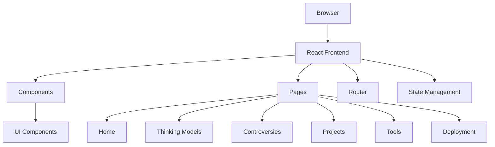

## 1. Architecture Design
纯前端React应用，使用React Router进行路由管理，Tailwind CSS进行样式设计，Zustand进行状态管理。

## 2. Technology Description
- Frontend: React@18 + TypeScript + tailwindcss@3 + vite
- Initialization Tool: vite-init
- Backend: None
- Database: None
- Additional Libraries: react-router-dom, zustand, lucide-react, highlight.js

## 3. Route Definitions
| Route | Purpose |
|-------|---------|
| / | 首页 |
| /thinking-models | 5大核心思维模型 |
| /controversies | 3大业内硬核争议 |
| /projects | 10个阶梯式实战项目 |
| /tools | SOLO专属工具聚合页 |
| /deployment | 全流程部署指南 |

## 4. API Definitions
无需后端API。

## 5. Server Architecture Diagram
无需后端服务。

## 6. Data Models
无需数据库。

