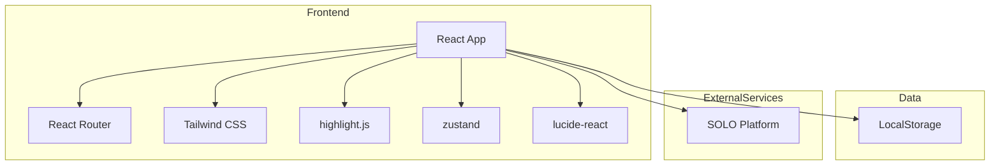
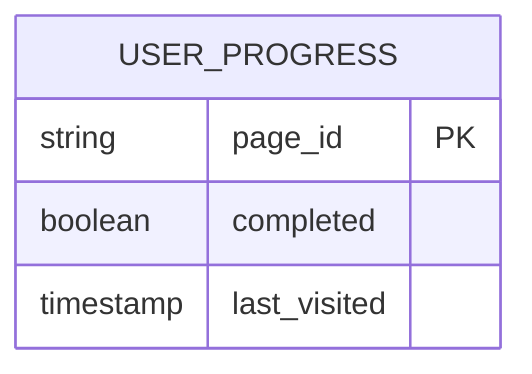

## 1. Architecture Design
纯前端应用，使用React + TypeScript + Vite + Tailwind CSS构建

## 2. Technology Description
- Frontend: React@18 + TypeScript@5 + TailwindCSS@3 + Vite@6
- Initialization Tool: vite-init
- Backend: None（纯前端应用）
- Database: LocalStorage（用于存储学习进度）
- 代码高亮: highlight.js
- 状态管理: zustand
- 图标库: lucide-react
- 路由: react-router-dom

## 3. Route Definitions
| Route | Purpose |
|-------|---------|
| / | 首页 - 学习路径导航 |
| /thinking-models | 思维模型页面 |
| /controversies | 行业争议页面 |
| /projects | 实战项目页面 |
| /tools | 工具聚合页面 |

## 4. API Definitions
无后端API

## 5. Server Architecture Diagram
无后端

## 6. Data Model
### 6.1 Data Model Definition
无数据库，使用LocalStorage存储学习进度

### 6.2 Data Definition Language
无数据库DDL
