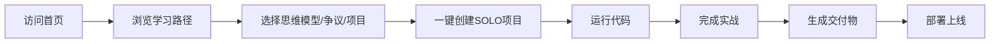

## 1. Product Overview
SOLO平台专属Python数据分析全栈学习网站，主打「代码+业务+实战」三位一体的阶梯式学习体系，完美呼应SOLO「More Than Coding」品牌定位。
- 目标用户：开发者、办公人群、数据分析学习者
- 目标价值：提供可直接在SOLO平台内运行的代码、实战项目、避坑指南及专业交付物

## 2. Core Features

### 2.2 Feature Module
1. **首页**：SOLO品牌呼应页、阶梯式学习路径、快捷入口
2. **5大核心思维模型**：标准定义、可运行Python代码、一键创建项目
3. **3大业内硬核争议**：争议核心、正反论据、研究拓展入口
4. **10个阶梯式实战项目**：知识点、一键创建项目、完整代码、避坑指南、交付物
5. **SOLO专属工具聚合页**：报告生成、文献综述、PPT导出等快捷入口
6. **全流程部署指南**：SOLO内项目生成到上线的完整教程

### 2.3 Page Details
| Page Name | Module Name | Feature description |
|-----------|-------------|---------------------|
| 首页 | Hero区域 | 呼应「More Than Coding」品牌slogan，展示平台核心能力 |
| 首页 | 学习路径 | 「入门→基础→进阶→高阶→综合」分级全景图，彩色标签标识 |
| 首页 | 快捷入口 | SOLO Auto Model、代码运行环境、学习包下载入口 |
| 思维模型页 | 模型展示 | 每个模型含定义、业务价值、可运行代码块、一键创建项目按钮 |
| 业内争议页 | 争议分析 | 正反论据、适用场景、研究分析、Web Reading能力入口 |
| 实战项目页 | 项目列表 | 10个项目按难度递进，每个含知识点、一键创建、分步代码、避坑标注、交付物生成 |
| 工具聚合页 | 工具入口 | 数据分析报告、文献综述、PPT导出、环境配置、部署引导 |
| 部署指南页 | 教程展示 | SOLO到GitHub、Cloudflare Pages部署、域名绑定完整流程 |

## 3. Core Process
用户访问网站 → 浏览学习路径 → 选择感兴趣的内容 → 一键创建SOLO项目 → 运行代码 → 完成实战 → 生成交付物 → 部署上线

## 4. User Interface Design
### 4.1 Design Style
- 主色调：SOLO平台原生科技蓝、深灰色为主
- 按钮风格：圆角矩形、悬浮有阴影
- 字体：现代无衬线字体，层次清晰
- 布局风格：卡片式布局，固定顶部导航
- 主题：支持深浅双模式切换
- 图标：简洁的线性图标

### 4.2 Page Design Overview
| Page Name | Module Name | UI Elements |
|-----------|-------------|-------------|
| 首页 | Hero区域 | 大标题、品牌slogan、渐变色背景、简洁动画 |
| 首页 | 学习路径 | 彩色标签卡片、垂直时间线布局、点击跳转 |
| 思维模型页 | 代码块 | 语法高亮、一键复制/运行按钮 |
| 实战项目页 | 项目卡片 | 难度标识、新手必踩坑红色高亮 |
| 全局 | 导航 | 固定顶部、页面锚点、返回顶部 |

### 4.3 Responsiveness
- 桌面端优先设计
- 移动端自适应布局
- 触摸交互优化

