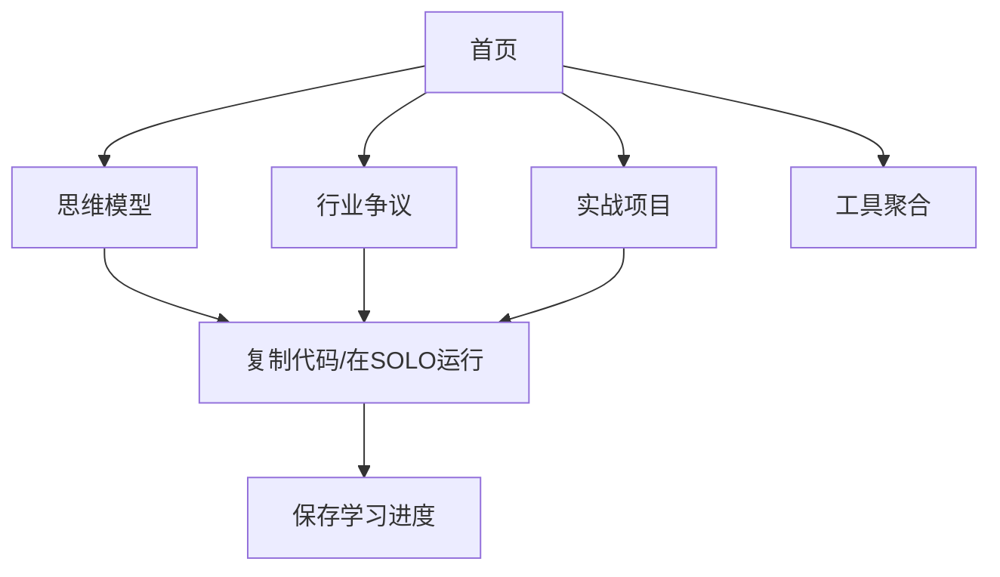

## 1. Product Overview
一站式数据分析技术学习平台，覆盖"零基础入门 → 工具进阶 → 实战项目 → 高级应用"全链路，以配套学习包和项目练习代码为核心内容载体。
- 主要面向零基础想入门数据分析的学习者、有基础需提升实战能力的职场人、高校相关专业学生
- 旨在提供专业、系统、可实操的数据分析学习路径，降低学习门槛

## 2. Core Features

### 2.1 Feature Module
1. **首页**: 网站介绍、学习路径导航、快速入口
2. **思维模型页面**: 5个全领域专家共识核心思维模型
3. **行业争议页面**: 3个业内专家硬核争议
4. **实战项目页面**: 10个全覆盖实操实训项目
5. **工具聚合页面**: SOLO平台相关工具链接

### 2.3 Page Details
| Page Name | Module Name | Feature description |
|-----------|-------------|---------------------|
| 首页 | 学习路径 | 4个学习阶段的阶梯式导航，难度从低到高 |
| 首页 | 快速入口 | 直达思维模型、项目实战、工具页面的卡片 |
| 思维模型页面 | 模型列表 | 5个思维模型，每个包含定义、业务价值、代码示例 |
| 行业争议页面 | 争议列表 | 3个争议话题，每个包含正反双方论据、适用场景 |
| 实战项目页面 | 项目列表 | 10个实战项目，每个包含核心知识点、详细任务、新手必踩坑 |
| 所有页面 | 代码块功能 | 支持代码复制、在SOLO中运行 |
| 所有页面 | 学习进度 | 基于本地存储保存用户学习进度 |

## 3. Core Process
用户访问网站 → 浏览首页了解学习路径 → 根据需求进入对应页面学习 → 阅读教程、复制代码、在SOLO中运行 → 完成项目练习 → 继续下一阶段学习

## 4. User Interface Design
### 4.1 Design Style
- 主色调：科技蓝(#165DFF)
- 辅助色：浅橙(#FF9A47)用于突出重点和引导按钮
- 背景色：浅灰(#F5F7FA)
- 正文色：深灰(#333333)
- 按钮风格：圆角矩形，hover时有颜色变化
- 字体：无衬线字体，Inter优先
- 布局风格：卡片式模块化，左侧固定导航栏，右侧主内容区
- 图标风格：使用lucide-react提供的简洁线性图标

### 4.2 Page Design Overview
| Page Name | Module Name | UI Elements |
|-----------|-------------|-------------|
| 首页 | 学习路径 | 4个阶段卡片，带有难度星级标识，hover时缩放动画 |
| 思维模型页面 | 模型卡片 | 白色卡片，标题带图标，代码块有语法高亮 |
| 实战项目页面 | 项目列表 | 可展开/折叠的项目卡片，包含项目详情和代码示例 |
| 所有页面 | 导航栏 | 左侧固定导航，深色背景，高亮当前页面 |
| 所有页面 | 页脚 | 包含GitHub链接、SOLO标识、联系方式 |

### 4.3 Responsiveness
- 桌面端：左侧导航栏+右侧内容区布局
- 平板/手机端：顶部导航栏+单列内容区布局
- 触摸优化：按钮和链接足够大，便于点击

### 4.4 3D Scene Guidance
不适用
